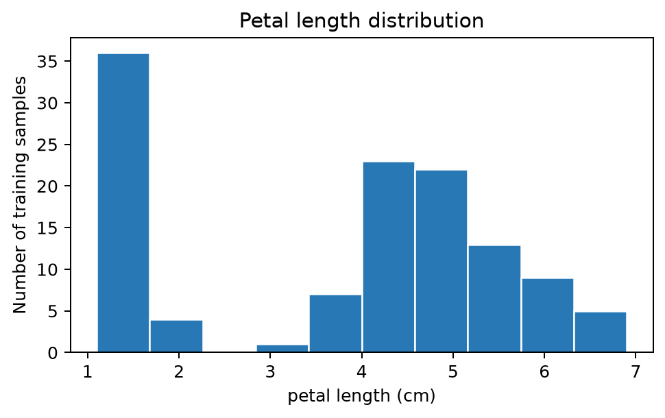

# 从 C 语言到 Python

## 从已有的编程经验出发

在 C 语言中，我们已经接触过用变量保存数据、用条件判断和循环控制程序执行，以及用函数组织可以重复使用的代码。这些基本思路在 Python 中仍然适用。学习 Python 时，可以从熟悉的程序出发，比较相同的计算过程在两种语言中如何表达。

本次实验以书店中的图书信息为例。计算购书费用，需要保存单价和数量；筛选有货的图书，需要逐条检查库存；统计库存总值，则需要重复计算并累加。我们将借助这些例子回顾已有的编程方法，熟悉 Python 的写法，并认识列表、字典等组织数据的方式。例中的书名、价格、库存与销量均为人工构造的教学数据，便于手工核对计算结果。

随后，实验将引入 NumPy 数组，处理一批数值的计算；通过类组织相关的数据和操作；最后调用 scikit-learn，完成数据准备、模型训练与预测的基本流程。分类部分先学习如何使用已有模型，算法内部的数学计算将在后续实验中展开。

环境安装与运行方法见实验手册。建议课前完成安装和首次运行。完成安装后，先运行下面的小程序，确认代码由哪个 Python 解释器执行。

## 文件、解释器与运行结果

此前运行 C 程序时，通常需要先将源文件编译为可执行文件。运行本课的 Python 脚本时，把保存代码的 `.py` 文件交给 Python 解释器即可。例如，将代码保存为 `hello.py` 后，在该目录的终端输入 `python hello.py`，就是让 Python 执行这个文件。编辑器用于修改文件，终端用于输入运行命令。

另一种方式是打开 `.ipynb` 格式的 Jupyter Notebook。Notebook 将说明文字、代码和输出放在一起，由内核执行代码单元。`practice.ipynb` 配合讲义练习基础操作，不要求提交。正式作业分别在 `code/bookstore` 和 `code/iris` 中完成，各目录的 README 说明补全位置与运行方法。下面的 Python 代码可以写在脚本或 Notebook 代码单元中；上面的运行命令则在终端中输入。

```python
import sys
print(sys.executable)
print("你好，Python！")
```

`print` 将内容显示出来，作用上可以联系 C 中的输出函数。这里先用 `import sys` 导入 Python 的标准库模块 `sys`，再读取 `sys.executable`，显示当前解释器的位置。电脑上可能有多个 Python 环境，这个路径可以帮助我们核对程序是否正在课程环境中运行。第二行输出是问候语。

**检查点 C1：** 修改问候语，保存并重新运行。你改的是文件中的哪一行？输出是否真的改变？

Notebook 的内核会保留已执行单元产生的变量和函数。修改代码后，需要重新执行相应单元，内核中的状态才会更新；例如修改函数后，要先运行函数定义单元，再运行调用它的单元。

\clearpage

# 变量与容器：把问题写成数据

## 变量、数值与字符串

一本书单价 32 元，购买两本，总价为 64 元。在 C 语言中，可以先用 `double price = 32.0;` 和 `int quantity = 2;` 定义单价与数量，再计算它们的乘积。Python 中可以这样写：

```python
title = "星空旅行"
price = 32.0
quantity = 2
in_stock = True
total = price * quantity
print(title, total)
```

运行后显示 `星空旅行 64.0`。乘法与赋值的写法和 C 语言相近；这里用 `print` 显示结果，每条语句末尾不需要分号。`=` 用于赋值，`==` 用于比较是否相等，变量名仍区分大小写。

Python 的赋值语句不需要在变量名前声明类型。上例中的 `32.0` 是浮点数 `float`，`2` 是整数 `int`，带引号的 `"星空旅行"` 是字符串 `str`。`in_stock` 保存布尔值 `True`，表示有货；表示无货时可以用 `False`。这两个布尔值的首字母均大写。

类型仍然影响运算的含义。`32.0 + 32.0` 得到数值 `64.0`，而 `"32.0" + "32.0"` 得到拼接后的字符串 `"32.032.0"`。可以用 `type(price)` 查看类型，用 `float("32.0")` 将表示数值的文本转换为浮点数。后面从文件读取价格时，还会用到这种转换。

数值的加、减、乘分别使用 `+`、`-`、`*`。除法需要留意与 C 整数运算的区别：Python 中 `5 / 2` 得到 `2.5`，`5 // 2` 得到 `2`，其中 `//` 表示向下取整的除法。余数使用 `%`，乘方使用 `**`，例如 `2 ** 3` 得到 `8`。

**检查点 C2：** 不运行先预测 `"3" + "2"`、`3 + 2`、`3 * 2` 的结果，再运行核对。把购买册数改成 3，预期总价是多少？

\clearpage

## 列表按位置找，字典按名字找

只有一本书时，几个变量就能保存所需信息。书目增加后，我们需要把相关的数据组织起来。

先考虑几本书的书名。在 C 语言中，我们接触过用数组按位置访问多个元素。Python 的列表也支持按位置取值，下标同样从 0 开始：

```python
titles = ["星空旅行", "山间日记", "海边故事"]
print(titles[0])
print(titles[0:2])
print(len(titles))
```

三行输出依次为第一本书的书名、前两本书组成的列表，以及元素个数 `3`。切片 `titles[0:2]` 取出下标从 0 开始、到 2 之前的元素，包含下标 0 和 1。这个列表的有效非负下标是 0、1、2，访问 `titles[3]` 会越界。

这里可以借助数组理解按下标访问的方式；Python 列表的长度可以改变，也可以保存不同类型的元素，与 C 数组的类型和存储规则有所不同。

一本书还包含价格和库存。我们可以用字典把这些信息放在一起，用键说明每个值的含义：

```python
book = {"title": "星空旅行", "price": 32.0, "stock": 5}
print(book["price"])
```

`book["price"]` 得到 `32.0`。列表通过下标访问元素，字典通过键查找对应的值；本例使用 `"title"`、`"price"` 和 `"stock"` 三个字符串作为键。

把每本书写成一条字典记录，再将这些记录放进列表，就得到了后续程序使用的书目：

```python
books = [
    {"title": "星空旅行", "price": 32.0, "stock": 5},
    {"title": "山间日记", "price": 25.0, "stock": 0},
    {"title": "海边故事", "price": 18.0, "stock": 3},
]
```

这份书目对应以下数据：

| 书名 | 单价（元） | 库存（册） |
| --- | ---: | ---: |
| 星空旅行 | 32.0 | 5 |
| 山间日记 | 25.0 | 0 |
| 海边故事 | 18.0 | 3 |

读取第一本书的库存可以写成 `books[0]["stock"]`。其中，`books[0]` 先取出第一条记录，后面的 `["stock"]` 再从这条记录中取出库存，结果为 `5`。

**检查点 C3：** 第一条记录的库存怎样取出？把第二条记录的库存改为 2，后面的有货判断会怎样变化？完成修改实验后恢复原始数据，以便与给定预期结果比较。

\clearpage

## 从记录到多维数据 \*

\* 表示选读内容。

前面用字典保存一本书的信息，用列表组织多本书的记录。进行数值计算时，我们还可以从记录中取出所需的数值，按明确的顺序排列。例如，三本书的价格可以排成一列，三天的销量可以排成一张表。随着数据增加，程序需要知道每个位置对应哪本书、哪一天，以及哪家书店。

本节先认识这些数据的组织方式。代码使用第 6 章将介绍的 NumPy，可以先阅读例子，在完成 NumPy 安装与导入后再运行。

### 形状记录了什么

教材附录 A 用向量表示一组有序的数，用矩阵表示按行、列组织的数。在机器学习编程中，标量、向量和矩阵的数值表示还可以推广到具有更多轴的数组，统称为张量数据。定位其中一个元素时，需要沿每个轴指定位置；形状则记录各轴的长度。本节用 NumPy 数组演示这种表示方式，后续使用 PyTorch 时会接触它的 `Tensor` 类型。

| 数据 | 各轴的含义 | 形状示例 |
| --- | --- | --- |
| 一本书的价格 | 无轴，单个数值 | `()` |
| 三本书的价格 | 图书 | `(3,)` |
| 三天中三本书的销量 | 日期、图书 | `(3, 3)` |
| 两家书店的上述销量 | 书店、日期、图书 | `(2, 3, 3)` |

这里 `(3,)` 表示一个轴、长度为 3。数学上含三个分量的向量可以称为三维向量；在数组表示中，它可以是只有一个轴的一维数组。“向量有几个分量”和“数组有几个轴”说的是不同的事情。

```python
import numpy as np

prices = np.array([32.0, 25.0, 18.0])
print(prices.shape)  # (3,)
print(prices.ndim)   # 1
```

`shape` 给出形状，`ndim` 给出轴的数量。它们描述结构；每个轴代表什么，还需要结合数据来源说明。列表和字典中混合的书名、价格与库存，也不能仅通过换一个类型名就获得适合模型计算的数值表示。

\clearpage

### 图像为什么有通道轴

在前馈神经网络章节，我们讨论过如何使用卷积处理图像的局部区域。在后续的可选实验“基于 CNN 的图像分类”中，也会涉及图像、NumPy 数组与张量之间的具体转换。我们将在这个具体的主题下，介绍张量的主要操作。

先从常规的 RGB 三通道图像开始，并仅考虑 2×2 的分辨率。每个像素由红、绿、蓝三个分量组成，下面依次放置红色、绿色、蓝色和白色四个像素：

```python
image_hwc = np.array([
    [[255, 0, 0], [0, 255, 0]],
    [[0, 0, 255], [255, 255, 255]],
], dtype=np.uint8)

print(image_hwc.shape)    # (2, 2, 3)
print(image_hwc[0, 1])    # [  0 255   0]
```

三个轴依次是高度 `H`、宽度 `W` 和颜色通道 `C`。`image_hwc[0, 1]` 取出第一行第二列像素的三个颜色分量。`uint8` 表示无符号 8 位整数，适合保存本例中 0 到 255 的分量值。

图像模型还可能要求通道在前，用 `C、H、W` 的顺序接收一张图像。调整轴顺序时，应同时保持各个数值对应的像素与通道不变：

```python
image_chw = image_hwc.transpose(2, 0, 1)
print(image_chw.shape)    # (3, 2, 2)
print(image_chw[:, 0, 1]) # [  0 255   0]

image_float = image_chw.astype(np.float32) / 255.0
print(image_float[:, 0, 1])  # [0. 1. 0.]
```

`transpose(2, 0, 1)` 将原来的第 2 个轴放到最前，原来的第 0、1 个轴随后排列。像素的含义保持不变。其中，`astype(np.float32)` 转换数值类型，除以 `255.0` 将取值范围缩放到 0 到 1。换轴、类型转换和数值缩放分别完成不同的工作。

多张相同形状的图像可以沿一个新的轴组合成批次。下面为了观察形状，将同一张小图重复放置两次：

```python
batch = np.stack([image_float, image_float], axis=0)
print(batch.shape)  # (2, 3, 2, 2)
```

四个轴依次对应图像数量、通道、高度和宽度，常记为 `N、C、H、W`。这里的 `N=2` 表示批次中有两张图。实验指导书中的 MNIST 和 CIFAR-10 任务也需要检查批次与通道，但实际采用的轴顺序应以模型接口为准。

\clearpage

### 改变形状与交换轴

在连接模型的不同部分时，有时需要将一组数重新分组，有时需要改变各轴的位置。仅检查输出形状，可能无法发现这两种操作的区别：

```python
a = np.array([[1, 2, 3],
              [4, 5, 6]])

print(a.reshape(3, 2))
# [[1 2]
#  [3 4]
#  [5 6]]

print(a.transpose(1, 0))
# [[1 4]
#  [2 5]
#  [3 6]]
```

两个结果都是三行两列。这里 `reshape` 按默认的元素遍历顺序重新分组，转置则交换行与列的角色。因而，将图像从 `H、W、C` 排列改为 `C、H、W` 时，不能用 `reshape(C, H, W)` 代替换轴。

**想一想：** 上例中，原数组第一行第二列的数值 `2`，经过两种操作后分别位于哪里？如果把图像的通道与空间位置弄混，形状正确是否就足以说明输入正确？

### 在后续专题中继续使用

图像之外，表格、文本和语音也需要先明确数据各轴的含义，再决定转换方式。以下是实验指导书中可以继续观察的例子：

| 专题 | 数据组织与转换 | 可以先关注的问题 |
| --- | --- | --- |
| 第 1 章逻辑回归 | 将表格中的输入特征与标签分开，再转换成张量；一批特征可组织成“样本数、特征数” | 哪些列是输入，哪一列是标签？字符串类别是否已经编码？ |
| 第 4 章 CNN 图像分类 | 图像转换为数值数组，调整通道与像素范围，再组成批次 | 当前形状中的每个轴是什么？操作改变的是排列、类型还是数值？ |
| 第 7 章 Transformer 情感分析 | 文本分词后得到编号，按需要补齐或截断长度；`input_ids` 与 `attention_mask` 一起组成批次 | 哪些位置是真实词元，哪些是填充？编号仍是整数，不是词向量。 |
| 第 10 章语音识别 | 从卷积部分接到 GRU 前交换特征与时间轴，再为损失函数调整输出轴顺序 | 同一段序列进入不同模块时，各轴的位置为何会变化？ |

这几类数据处理都需要同时核对形状、数值类型和轴的含义。教材中的向量、矩阵、卷积与序列表示，可以由此联系到实验中的输入数据。

<!--
相关阅读位置：教材附录 A.1、A.2（书内第 276、279 页），第 3.1.5 节（第 76–78 页），第 5.2 节（第 159–160 页）；实验指导书第 1.5.2 节（第 9–10 页）、第 4.5.1 节（第 43–44 页）、第 7.5.2 节（第 103–104 页）及第 10 章第 147 页。上述页码均为书内印刷页码。
-->

\clearpage

# 条件、循环与函数

尽管在细节和链路上存在诸多差异，C 和 Python 在处理条件、循环和基本函数定义时，思路和语法大致相通。下面我们将用功能相同的 C 和 Python 代码块为例，展示并介绍共同点与具体写法上的差异。

以下 C 代码中的变量和控制流片段写在 `main` 内，函数定义写在 `main` 外，使用 `printf` 时需包含 `<stdio.h>`。

## 让程序判断和重复

### 条件：根据库存选择分支

两段程序都根据库存是否大于零，选择一条输出语句。

**C**

```c
int stock = 5;
if (stock > 0) {
    printf("有货\n");
} else {
    printf("暂时缺货\n");
}
```

**Python**

```python
stock = 5
if stock > 0:
    print("有货")
else:
    print("暂时缺货")
```

两段代码均输出“有货”。条件表达式 `stock > 0` 以及根据真假选择分支的过程相同。Python 省去了这里的类型声明、条件外侧的括号和语句末尾的分号，以冒号引出代码块，并用缩进表示哪些语句属于分支。

其他常见条件写法如下：

| 用途 | C | Python |
| --- | --- | --- |
| 相等比较 | `stock == 0` | `stock == 0` |
| 后续分支 | `else if (stock < 3)` | `elif stock < 3:` |
| 两个条件同时成立 | `stock > 0 && price <= budget` | `stock > 0 and price <= budget` |
| 至少一个条件成立 | `stock == 0` \|\| `price > budget` | `stock == 0 or price > budget` |
| 对比较结果取反 | `!(stock > 0)` | `not (stock > 0)` |

\clearpage

### 循环：依次取值并累加

两段程序都依次取出库存，把它加到累计值上，最后输出总数。

**C**

```c
int stocks[] = {5, 0, 3};
int stock_count = 0;
for (int i = 0; i < 3; i++) {
    stock_count += stocks[i];
}
printf("%d\n", stock_count);
```

**Python**

```python
stocks = [5, 0, 3]
stock_count = 0
for stock in stocks:
    stock_count += stock
print(stock_count)
```

两段代码均输出 `8`，都遵循“循环前初始化、循环中更新、循环后使用结果”的过程。这里 C 用下标访问数组元素，Python 直接遍历列表中的元素；`stock` 每次取得当前库存。`+=` 在这两段数值代码中的含义相同。

需要下标时，Python 也可以写成 `for i in range(len(stocks)):`，循环体中用 `stocks[i]` 取值。`range(3)` 依次给出 0、1、2，对应 C 例子中 `i` 的取值。

由此再看原来的 `for book in books`：处理过程仍是依次取出元素，只是 `books` 中的元素是一条字典记录，因此通过 `book["stock"]` 取得库存。下面仍用这份书目逐条判断是否有货。

```python
for book in books:
    if book["stock"] > 0:
        print(book["title"], "有货")
    else:
        print(book["title"], "暂时缺货")
```

**检查点 C4：** 为什么“累计值的初始化”应放在循环之前？若只想输出最终总册数，`print(stock_count)` 应放在哪里？

\clearpage

## 把计算写成一个短函数

两段函数都接收单价和购买数量，返回两者的乘积。

**C**

```c
double book_cost(double price, int quantity) {
    double cost = price * quantity;
    return cost;
}
```

**Python**

```python
def book_cost(price, quantity):
    cost = price * quantity
    return cost
```

两种语言都可以用 `book_cost(32.0, 2)` 调用函数，计算结果为 `64.0`。参数名代表本次调用传入的数据，`return` 将计算结果交回调用处；函数调用的结果还可以赋给变量或参与后续计算。

C 在函数定义中声明返回类型和参数类型。Python 用 `def` 开始定义，本例无需写类型声明，函数体仍由缩进界定。参数、调用和返回值之间的关系与 C 中的基本用法相通。

在调用处，C 中的 `double result = book_cost(32.0, 2);` 对应 Python 中的 `result = book_cost(32.0, 2)`。在 C 中，`printf` 显示内容，`return` 将结果交回调用处；Python 的 `print` 和 `return` 也有这样的分工。Python 函数如果只打印结果而未显式返回计算结果，调用的返回值是 `None`。

**检查点 C5：** 把函数里的 `return cost` 暂时换成 `print(cost)`，再用 `result = book_cost(32.0, 2)` 调用，观察 `result`。实验后恢复原来写法。

\clearpage

# 从基础操作到两个微项目

前面已经回顾变量、容器、条件、循环和函数。接下来通过两个微项目把这些操作连接起来：书店程序主要练习数据组织、对象和计算；鸢尾花程序练习识别库的调用关系，完成简单训练与结果验证。

项目代码中的 `LAB01_TODO` 标出需要补全的位置。每一步的输入、返回值和完成标准见对应项目说明；讲义提供概念与小例子，不需要把同一功能再实现一遍。

## 微型书店：从数据记录到管理与统计

书库 `books.csv` 保存书名、进货成本、当前售价和库存；销售记录 `sales.csv` 保存已经发生的销售数量与成交单价。同名书的进货成本在本项目中保持不变。程序通过书名关联两份数据，计算销售额和毛利，读取历史记录时不再次扣库存。

| 阶段 | 在项目中完成什么 | 对应的编程内容 |
| --- | --- | --- |
| B1、B2 | 图书初始化、补货与改价 | 对象属性、方法与状态更新 |
| B3 | 补全销售记录的解析方法 | 字符串转换、字典、继承与重写 |
| B4 | 查询预算内有货的图书 | 遍历、条件组合与返回列表 |
| B5 | 按书名匹配成本，整理数值数组 | 字典查询、记录对应与数组构造 |
| B6 | 计算销售额、毛利并汇总 | 数组逐元素运算与求和 |

书库读取、菜单、保存和显示工具已提供。完成图书初始化后即可进入菜单，其余未完成的位置会提示相应编号。补货和改价先改变内存中的对象，选择保存后才写入 CSV。

书店的独立验证程序使用内置固定样例，可按阶段运行。你修改自己的书库后，程序输出可能变化，但公开检查的预期值不会跟着改变。项目说明见 [微型书店](code/bookstore/README.md)。

## 鸢尾花：连接数据与模型接口

鸢尾花数据包含四项测量值和真实品种标签。框架提供数据读取、固定划分、绘图与评价，学生选择散点图的两个特征，再在同一段流程中补上训练和预测调用。

`fit` 使用训练特征与训练标签，让模型学习；`predict` 使用训练好的同一对象，对测试特征给出预测。真实测试标签留给后面的评价部分，不作为预测输入。第 8 章将展开这些关系。

项目的完成标准包括调用检查通过、程序从头运行产生结果，以及对实际图形和错分作简短说明；不按准确率高低排名。详见 [鸢尾花项目](code/iris/README.md)。

## 运行、检查和返回值

`raise NotImplementedError(...)` 是框架中的待实现提示，补全时用实际代码替换。它与安装失败不同。函数是否正确，既要看返回内容，也要看不同输入下的行为；仅打印一个数值并不等于把结果返回给调用者。

```bash
python bookstore/check_book_tasks.py --stage B4
python iris/check_iris.py
```

上面的检查命令在 `code` 目录的终端中运行。书店检查可在前置阶段尚未全部完成时独立运行；鸢尾花检查会核对训练与预测所接收的数据、使用的模型和返回结果。

[practice.ipynb](code/practice.ipynb) 用于配合讲义运行和修改短例子，不要求提交。正式提交的是两个微项目的代码、所需辅助文件与简短 PDF 结果报告，完整目录见实验手册。

\clearpage

# 文件与调试

## 从文本读到数值

前面的书目直接写在代码中。把数据单独存入文件后，程序就可以读取文件内容，再进行相同的处理。配套的 `books.txt` 位于 `code` 文件夹，可在该目录的 Notebook 或自行创建的脚本中读取，每行形如 `星空旅行,32.0,5`，依次记录书名、价格和库存。

这里可以联系 C 语言中打开、读取和关闭文件的过程。Python 的 `with open(...)` 将文件的使用范围写成一个代码块，离开这个代码块时会自动关闭文件。下面先读取各行，再逐行拆分并转换数据：

```python
with open("books.txt", "r", encoding="utf-8") as file:
    lines = file.readlines()

for line in lines:
    fields = line.strip().split(",")
    title = fields[0]
    price = float(fields[1])
    stock = int(fields[2])
    print(title, price, stock)
```

`"r"` 表示以读取方式打开文件，`encoding="utf-8"` 指定按 UTF-8 编码解读文本。`readlines()` 将各行读入列表 `lines`，因此文件关闭后仍可以遍历这些已经读入的数据。

对每一行，`strip()` 先去掉两端空白，包括行末换行，`split(",")` 再按逗号拆分，得到三个字符串。此时价格 `"32.0"` 和库存 `"5"` 都还是文本，需要分别用 `float` 和 `int` 转换后才能参与数值计算。这与第 2 章区分文本和数值的例子相呼应。本例只处理给定的三字段文本格式。

\clearpage

### 路径从哪里开始

`open("books.txt", ...)` 中的字符串说明要访问哪个文件。这个写法没有包含完整位置，因此程序需要从当前工作目录开始查找。当前工作目录是运行时使用的起点，与脚本保存的位置可能不同；在 Notebook 中也需要核对内核的当前工作目录。

以下为实验目录节选；假设 `hello.py` 中保存了上述读取代码：

```text
实验目录/
|-- README.md
|-- assets/
`-- code/
    |-- books.txt
    `-- hello.py  (自行创建的脚本)
```

假设当前工作目录是 `code`，几种常见路径的含义如下。

| 写法 | 含义 | 在上述目录中的位置 |
| --- | --- | --- |
| `.` 或 `./` | 当前目录 | `code` |
| `..` 或 `../` | 当前目录的上一级 | 实验目录 |
| `books.txt` 或 `./books.txt` | 从当前目录查找文件 | `code` 中的书目文件 |
| `../README.md` | 先到上一级，再找文件 | 实验目录中的说明文件 |
| `../assets/` | 先到上一级，再进入子目录 | 实验目录中的图片与样式目录 |
| `D:/course/lab01/code/books.txt` | 包含盘符和完整位置的绝对路径 | 示例位置，需换成自己电脑上的真实路径 |

相对路径的含义随起点变化。如果当前工作目录改为实验目录，书目文件就应写成 `code/books.txt`。即使从这里运行 `python code/hello.py`，脚本中的 `open("books.txt")` 仍会从当前工作目录查找，不会自动改到脚本旁边。

可以用下面的代码核对查找位置。`os` 是 Python 的标准库模块，无需另行安装。

```python
import os

filename = os.path.join(".", "books.txt")
print("当前工作目录：", os.getcwd())
print("文件的绝对路径：", os.path.abspath(filename))
print("目标是否为文件：", os.path.isfile(filename))
```

`os.path.join` 按运行系统的规则拼接路径。`os.path.abspath` 把这里的相对路径表示成绝对路径，便于看清程序实际查找的位置；它不会移动文件或改变当前工作目录。`os.path.isfile` 检查目标是否为文件，正常情况下可以据此帮助判断路径是否指向预期目标。

当终端已经进入本课 `code` 目录时，最后一行应输出 `True`。如果输出 `False`，先核对第二行中的位置和文件名，再决定调整运行目录还是修改路径。

Windows 路径中的反斜杠还需要注意字符串转义。与 C 字符串类似，Python 普通字符串中的 `\n`、`\t` 等有特殊含义。在 Python 文件操作中，可以使用正斜杠，或者用 `r` 开头的原始字符串保留反斜杠，例如 `"D:/course/lab01/code/books.txt"` 与 `r"D:\course\lab01\code\books.txt"`。这里的 `r` 只影响字符串写法，不会把相对路径变成绝对路径。

写入模式 `"w"` 会覆盖同名文件，练习时使用专门的测试文件。

\clearpage

## 根据报错定位问题

报错信息通常同时给出异常类型、简短解释和相关代码位置。可以先看最后一行判断问题属于哪一类，再找到自己编写的代码及行号，检查这一行用到了哪些变量、文件或数据。

例如，三元素列表 `titles` 的有效非负下标是 0、1、2。访问 `titles[3]` 时，可能看到这样的输出：

```text
Traceback (most recent call last):
  File "demo.py", line 2, in <module>
    print(titles[3])
IndexError: list index out of range
```

最后一行的 `IndexError` 表示索引超出范围；上面的代码行则指出发生问题的访问。回到程序中，检查 `titles` 的长度和下标如何产生，就能进一步定位原因。

下面保留常见英文报错片段，便于与实际输出对照。完整措辞、行号和箭头标记可能随 Python 版本变化。阅读语法错误时，也应检查提示位置附近及上一行的括号、引号和冒号。

### 代码与数据

| 典型报错片段 | 含义与本课例子 | 优先检查 |
| --- | --- | --- |
| `SyntaxError: expected ':'` | 语法结构不完整，例如 `if stock > 0` 后缺少冒号 | 该行及附近的冒号、括号、引号是否配对 |
| `IndentationError: expected an indented block` | 应有代码块的位置缺少缩进 | `if`、`for`、`def` 后的语句是否缩进；同层是否对齐 |
| `NameError: name 'prcie' is not defined` | 当前找不到这个名字，例如将 `price` 拼成 `prcie` | 拼写、大小写，以及定义或导入所在的 Notebook 单元是否已执行 |
| `TypeError: can only concatenate str (not "int") to str` | 操作使用了不兼容的类型，例如 `"32.0" + 1` | 参与运算的数据类型；是要数值相加，还是拼接文字 |
| `ValueError: could not convert string to float` | 转换收到的文本无法按数值解释，例如 `float("价格")` | 实际字段内容、分隔符和表头；不要只看变量名猜类型 |
| `IndexError: list index out of range` | 列表下标越界，例如三元素列表的 `titles[3]` | 列表长度和下标；读文件时也要看拆分出了几个字段 |
| `KeyError: 'prcie'` | 字典中没有这个键，例如 `book["prcie"]` | 键名拼写和实际记录包含的键 |
| `AttributeError: 'list' object has no attribute 'shape'` | 对象没有所访问的属性，例如把列表当作 NumPy 数组读取 `.shape` | 对象的实际类型，以及需要的属性或方法属于哪种对象 |

\clearpage

### 文件、编码与环境

| 典型报错片段 | 含义与本课例子 | 优先检查 |
| --- | --- | --- |
| `FileNotFoundError: [Errno 2] No such file or directory` | 文件操作无法找到指定路径，例如读不到 `books.txt` | 当前工作目录、拼接后的路径、文件名及是否已解压材料 |
| `PermissionError: [Errno 13] Permission denied` | 文件操作被拒绝；Windows 中也可能是把目录当成文件，或文件被其他程序占用 | 目标是否为文件、读写权限和占用情况 |
| `UnicodeDecodeError: 'utf-8' codec can't decode byte` | 文件字节无法按所指定的 UTF-8 编码解读 | 文件实际编码是否与 `encoding` 一致，是否误读了二进制文件 |
| `ModuleNotFoundError: No module named 'numpy'` | 当前 Python 环境找不到所导入的模块 | 先用 `sys.executable` 确认解释器，再按手册核对该环境的依赖 |

`NameError` 与 `KeyError` 都可能由拼写错误引起，但访问位置不同：前者是程序中的名字，后者是字典中的键。类似地，`import numpy` 找不到库时会出现 `ModuleNotFoundError`，尚未执行 `import numpy as np` 就使用 `np` 则可能出现 `NameError`。

### 没有异常，也要检查结果

练习 Notebook 中有些位置暂用 `None` 表示尚未完成的结果；项目代码则用 `NotImplementedError` 标明待实现功能。函数若只写 `pass` 而没有返回计算结果，调用后也会得到 `None`。完成函数后仍得到 `None`，可以检查是否只打印了结果、是否执行了带结果的 `return`，以及 Notebook 是否重新执行了修改后的定义。

另一类情况是程序正常结束，却算出了错误答案。例如把累计值初始化放进循环，就可能只留下最后一条记录的贡献。此时应当核对中间值和计算过程，报错表不能代替对逻辑的检查。

可以在单独的 Notebook 单元中试运行表内的错误示例，每次只检查一条，观察报错后再修复。Notebook 修复后也需要重新执行受影响的单元，检查结果是否更新。

**检查点 C6：** 遇到问题时，对照报错所在行检查变量与输入，判断是路径、名字、类型还是计算逻辑问题。修复后重新运行核对，不要求另交调试记录。

现在，书目既可以写在程序中，也可以从文件读入。它们经过合适的组织和类型转换后，都可以交给条件、循环与函数处理。下一章将进一步考虑对一批数值进行统一计算。

\clearpage

# NumPy：组织数值并计算

## 从安装、导入到第一次计算

书店需要统计一批销售记录，或汇总几天的销量。用列表和循环可以完成；NumPy（Numerical Python）提供数值数组，让这些计算写得更直接。它不是 Python 自带的列表，需要先安装到正在使用的环境。

**第一步：在终端安装。** 先激活课程环境，再运行下面两行。常见的 `pip install numpy` 是安装 NumPy 的命令；本课写成 `python -m pip install numpy`，明确使用当前 Python 对应的 pip。已安装成功的同学不必每次运行程序都重装。

```bash
conda activate ustc-ai-experiments-26fall-B
python -m pip install numpy
```

上面是终端命令，不是 Python 语句，不要粘贴到 `.py` 文件或普通 Notebook 代码单元中。安装失败先检查环境与网络，不随意更改系统 Python。

**第二步：在程序中导入。** 打开脚本或 Notebook，写：

```python
import numpy as np

prices = np.array([10.0, 20.0, 30.0])
print(prices * 2)  # [20. 40. 60.]
```

逐段读懂 `import numpy as np`：`import` 将已安装的模块导入当前程序；`numpy` 是模块名；`as np` 给它取一个短名字。以后 `np.array(...)` 就是通过这个名字调用 NumPy 的 `array` 函数。`np` 不是另外一个库，也不是 Python 的关键字。

也可以写 `import numpy`，随后使用 `numpy.array(...)`，但本课统一用惯用的 `np`。安装通常只需对每个环境做一次；导入则要在每个新脚本或重启后的 Notebook 中执行。

**先预测：** `[10, 20] * 2` 会重复列表，得到 `[10, 20, 10, 20]`；`np.array([10, 20]) * 2` 会逐项乘二，得到 `[20, 40]`。数组擅长统一数值运算；列表更适合保存不同类型的对象。

如果出现 `ModuleNotFoundError`，检查当前解释器是否装了 NumPy；如果出现 `NameError: name 'np' is not defined`，检查导入单元是否执行。不要把自己的文件命名为 `numpy.py`，以免遮住真正的库。

\clearpage

## 常用操作：创建、查看、取值与统计

先建立两个小数组。`prices` 是一维数组，形状 `(3,)` 表示一个轴上有三个元素；它不是形状 `(1, 3)` 的二维行数组。`sales` 的形状 `(3, 3)` 表示三行三列。

```python
prices = np.array([10.0, 20.0, 30.0])
sales = np.array([[2, 1, 0],
                  [1, 3, 2],
                  [0, 2, 1]])
```

这里每行是一日的销量，每列是一种书，单位是册；`prices` 按相同书目顺序记录单价，单位是元/册。这是一个单独的三日销量例子，不是前面的库存表。

| 写法 | 用途与本例结果 |
| --- | --- |
| `np.array([10, 20, 30])` | 把列表变成数组 |
| `np.zeros((2, 3))` / `np.ones(3)` | 创建两行三列全零数组 / 三元素全一数组 |
| `np.arange(6)` | 得到 0、1、2、3、4、5，不含终点 6 |
| `np.linspace(0, 1, 3)` | 在闭区间取三个等距数：0、0.5、1 |
| `sales.shape` / `sales.ndim` | 形状 `(3, 3)` / 轴数 2 |
| `sales.size` / `sales.dtype` | 元素个数 9 / 元素的数据类型 |
| `sales[1, 2]` | 第二行第三列，值为 2；索引从 0 开始 |
| `sales[:, 0]` / `sales[:2]` | 所有行的第一列 / 前两行 |
| `prices[prices <= 20]` | 用条件筛选，得到 10、20 |
| `np.sum(prices)` / `np.mean(prices)` | 总和 60 / 平均值 20 |
| `np.min(prices)` / `np.max(prices)` | 最小值 10 / 最大值 30 |
| `np.argmax(prices)` | 最大值的位置 2，不是最大值 30 |
| `np.arange(6).reshape(2, 3)` | 六个元素重新排成两行三列，元素总数不变 |
| `sales.T` | 转置：交换行、列；原数组不因这句而改写 |

这些常用操作不全是“方法”：`np.array(...)` 是模块中的函数，`sales.reshape(...)` 是数组对象的方法，`sales.shape` 则是属性。函数、方法执行操作时有括号；读取属性没有括号，不能写成 `sales.shape()`。

`:` 表示取一个范围，`sales[:, 0]` 中前面的 `:` 表示取全部行。条件 `prices <= 20` 先得到三个真假值，再用它们选中对应位置。只需记住这几种常用读法，可结合实际计算逐步熟悉索引语法。

\clearpage

## 沿哪个方向计算：三日收入与销量

第一天收入：2×10+1×20+0×30=40 元。第二天为 1×10+3×20+2×30=130 元，第三天为 0×10+2×20+1×30=70 元。

```python
print(sales.shape)
print(sales[0] * prices)
print(np.sum(sales[0] * prices))
print(sales @ prices)
```

`*` 对数组做逐元素乘法，得到各项乘积；`np.sum` 将这些项相加；`@` 做矩阵乘法，在本例中一次算出三天收入，结果形状为 `(3,)`。行中三项销量必须对应价格的三项，不是看到两个数组就能相乘。

`axis` 指要汇总掉的轴。对当前二维表，`axis=0` 把多天合并，保留每种书；`axis=1` 把书的种类合并，保留每天。可先看输出再回到原表检查：

```python
print(np.sum(sales, axis=0))   # [3 6 3]，每种书的总销量
print(np.sum(sales, axis=1))   # [3 6 3]，每天的总销量
print(np.mean(sales, axis=0))  # [1. 2. 1.]，每种书日均销量
```

本例两种求和碰巧相同，不代表两个轴的含义相同。若把第一天第二种书的销量增加 1，列总和变成 `[3, 7, 3]`，行总和变成 `[4, 6, 3]`。用这个改动检查自己是否真的理解行、列。

修改练习用 `new_prices = prices.copy()` 创建独立数组，再令 `new_prices[2] = 40.0`。直接写 `new_prices = prices` 只是给同一个数组取另一个名字；普通切片也可能共享原数组的数据。初学时需要独立修改就明确使用 `.copy()`。

**检查点 C7：** 将第三种书的单价改为 40 元，先手算三天收入，再运行。回答“第几行代表什么、第几列代表什么”，不能只说程序运行成功。

书店项目的数组按销售记录排列，每一行对应一次销售。先按书名查到进货成本，将数量、成交单价和成本整理成对应数组，再进行逐元素计算与求和。这里的三日表按“日期、图书”组织，是理解形状和计算轴的补充例子；不能把两种数据排列直接混用。

## 本课与机器学习的连接

到这里完成的是“读取记录、表示成数值、执行计算、检查结果”，还没有训练预测模型。接下来的课堂演示会把一行当成一个样本、各列当成特征，用现成模型学习分类规则。下一次回归实验再展开目标函数与参数更新。

训练集用于学习参数，验证集用于选择设置，测试集用于最后评价；数据处理的统计量也应只从训练集估计。“能算出来”与“能对新数据作出可靠预测”不是一回事。第 8 节用固定设置的小例子认识这些边界。

\clearpage

# 面向对象：图书对象与读取器

## 构建一个类：把信息和操作放在一起

前面用字典保存每本书的信息。项目中还需要补货、改价等操作，可以把相关数据与操作组织成对象。`Book` 是类，描述一本书应保存什么；通过 `Book(...)` 创建的具体实例保存各自的数据。

下面是用于讲解的完整小例子。它采用与书店项目一致的四个属性，并增加一个展示方法，便于观察对象。

```python
class Book:
    category = "图书"

    def __init__(self, title, cost, price, stock):
        self.title = title
        self.cost = cost
        self.price = price
        self.stock = stock

    def describe(self):
        return f"{self.title}：售价 {self.price} 元，库存 {self.stock} 册"
```

`class Book:` 开始类定义，缩进到类内部的 `def` 定义方法。`__init__` 在创建对象时设置初始属性。`self` 指向正在操作的对象；调用方法时不需要再手动传入它。

`category` 写在类中，是共享的类属性；`self.title` 等在初始化时写入各个实例。每本书自己的价格、库存应保存在实例属性中，避免不同对象意外共用状态。

## 实例化、访问属性与调用方法

```python
first_book = Book("星空旅行", 20.0, 32.0, 5)
second_book = Book("海边故事", 10.0, 18.0, 3)
print(first_book.title)
print(first_book.describe())

first_book.price = 35.0
print(first_book.price)   # 35.0
print(second_book.price)  # 18.0
print(first_book.cost)    # 20.0
```

读取属性时写 `first_book.price`，执行方法时写 `first_book.describe()`。改变第一本书的售价，不会自动改变另一对象，也不会改变它的进货成本。项目中的 `set_price` 和 `restock` 方法把相应更新封装成操作入口，菜单只需调用这些方法。

两个名字也可能指向同一个对象：

```python
another_name = first_book
another_name.title = "星空旅行（新版）"
print(first_book.title)
print(another_name is first_book)  # True
```

赋值并没有再创建一本书。前面的两次 `Book(...)` 才分别创建两个实例。需要判断状态为什么联动时，先检查是否操作了同一个对象。

**检查点 C8a：** 改变第一本书的售价后，哪些属性发生变化？通过另一个名字修改同一对象时，又会看到什么？可以直接运行观察，不要求另写记录。

\clearpage

## 继承与重写：共用读取流程，分别解释数据

书库和销售记录都是 CSV 文件，打开文件、读取表头、逐行处理的步骤相似。差异在于一行数据的含义：书库行要变成图书对象，销售行要变成带数量和成交价的记录。这里让不同读取器继承同一个 `CSVReader`，复用共同过程。

下面用“已经读出的行”演示这个调用关系。`convert_rows` 只负责遍历；`parse_row` 由子类决定如何转换。项目中的 `CSVReader.read` 还包含打开文件与格式检查，由框架完整提供。

```python
class RowReader:
    def convert_rows(self, rows):
        results = []
        for row in rows:
            results.append(self.parse_row(row))
        return results

    def parse_row(self, row):
        raise NotImplementedError("由具体读取器解释一行数据")


class TemperatureReader(RowReader):
    def parse_row(self, row):
        return float(row["temperature"])


reader = TemperatureReader()
print(reader.convert_rows([
    {"temperature": "18.5"},
    {"temperature": "22.0"},
]))  # [18.5, 22.0]
```

`TemperatureReader` 没有重新写 `convert_rows`，仍可使用继承的方法。执行父类方法时，`self` 仍是当前的 `TemperatureReader` 对象，因此 `self.parse_row(row)` 调用子类的转换实现。这种重新定义同名方法的行为称为方法重写。

书店项目采用相同思路：`BookReader` 的解析已给出，学生完成 `SalesReader.parse_row`，不需要把文件读取循环复制一遍。

## 相同接口与父类实现

继承也可以在原有行为上增加内容。在上面的温度读取器外加一条转换日志，便可用 `super()` 调用已有实现：

```python
class LoggedTemperatureReader(TemperatureReader):
    def parse_row(self, row):
        value = super().parse_row(row)
        print("已转换：", value)
        return value


for reader in [TemperatureReader(), LoggedTemperatureReader()]:
    print(reader.convert_rows([{"temperature": "19.0"}]))
```

两次调用都返回 `[19.0]`，但第二种对象还会打印日志。相同接口可由不同对象给出各自行为，这是多态的一个简单例子。`super()` 调用继承链中的已有实现，不是在另建一个父类对象。

`isinstance(reader, RowReader)` 可以判断对象是否属于这个类或其子类。它有助于理解关系，不要求在每个业务函数中重复进行类型检查。

**检查点 C8b：** `SalesReader` 没有自己实现 `read`，为什么仍然能够读完整个文件？父类读取一行后，怎样执行到子类的解析方法？

## 对象集合、组合与保存

字典的值也可以是对象。书店项目用书名快速找到图书：

```python
catalog = {book.title: book for book in [first_book, second_book]}
selected = catalog["海边故事"]
print(selected.describe())
```

这里的字典推导式相当于逐本添加键值对。它组织的是已有对象，没有自动复制它们。书名用于查找，价格与库存则从对象属性中读取。

“书库中有一些图书”是包含关系；书库本身不是一本图书。更复杂的程序可以把这个对象集合保存在另一个类中，这种组织方式称为组合。本项目用字典即可，不要求为每一种集合再创建类。想进一步观察容器与对象，可查阅配套对象演示。

对象状态与磁盘文件也不同。调用补货、改价方法后，内存中的对象已经改变，但原 CSV 不会自动变化。菜单的保存操作才把当前属性写入 `books_updated.csv`；再次读取这个文件，才会以保存后的数据创建对象。

**检查点 C8c：** 在菜单中改价、查看、保存，再重新加载保存文件，比较各阶段的结果。读取已有销售记录时为什么不再次扣库存？

`practice.ipynb` 用计数器和带日志的子类演示对象使用与继承；这里的书店程序将这些方法用于实际的数据管理。接下来，scikit-learn 也会通过类和对象提供模型接口。

\clearpage

# scikit-learn：运行第一个分类模型

## 从自己的类过渡到库提供的类

鸢尾花项目要求识别并补全训练与预测调用，再验证初步结果。`iris_classification.py` 提供数据读取、固定划分、绘图和评价；以下小例子解释这些步骤之间的关系。

scikit-learn 是提供数据处理、模型训练和评价等工具的机器学习库。安装命令写 `scikit-learn`，导入时写 `sklearn`，两者名字不同。它不是 Python 解释器，也不替代后续课程要求手写的算法。

在已激活的终端中用 `python -m pip install scikit-learn` 安装。已经完成手册中的安装就直接导入；无需安装名为 `sklearn` 的包。常见组成如下，本次只使用其中少量入口：

| 模块 | 职责 | 本课中的名字 |
| --- | --- | --- |
| `sklearn.datasets` | 提供教学数据或数据生成工具 | `load_iris` |
| `sklearn.model_selection` | 数据划分、验证与模型选择 | `train_test_split` |
| `sklearn.tree` | 决策树模型 | `DecisionTreeClassifier` |
| `sklearn.metrics` | 比较预测与真实标签 | `accuracy_score`、`confusion_matrix` |
| `sklearn.preprocessing` | 数值预处理 | `StandardScaler`，补充查阅 |

`from sklearn.tree import DecisionTreeClassifier` 表示从 `sklearn` 的 `tree` 模块中导入模型类，之后直接写类名即可。它与 `import numpy as np` 都是导入语句，只是引入的名字不同。

从任务看，**分类**输出类别，如预测花的品种；**回归**输出连续数值，如预测销量；**聚类**在没有预先给定类别标签时按相似性分组。本次只做监督分类，即训练时提供特征和正确标签。不把聚类结果直接当成已经知道的真实类别。

## 读取数据：谁是样本、特征和标签

演示使用库内置的鸢尾花数据：150 个样本、每个样本 4 个测量特征、3 个品种。四列依次是花萼长度、花萼宽度、花瓣长度、花瓣宽度，单位为厘米。代码 `X` 是形状 `(150, 4)` 的特征矩阵；`y` 是形状 `(150,)` 的标签数组。标签 0、1、2 只是品种编号，不表示等级。数据随库提供，不需额外下载。

```python
from sklearn.datasets import load_iris

iris = load_iris()
X = iris.data
y = iris.target
print(X.shape, y.shape)
print(iris.feature_names)
print(iris.target_names)
print(X[0], y[0])
```

`iris` 是一个保存数据及说明的容器对象，可以用属性访问内容。`X[0]` 是第一朵花的四项测量，不是四朵花；`y[0]` 是这朵花的品种编号。`iris.target_names[y[0]]` 将编号换成名称。每一行特征必须与同位置的标签配对，不能各自独立打乱。

\clearpage

## 划分数据：不要拿考题训练

```python
from sklearn.model_selection import train_test_split

X_train, X_test, y_train, y_test = train_test_split(
    X, y, test_size=0.2, random_state=42, stratify=y
)
print(X_train.shape, X_test.shape)  # (120, 4) (30, 4)
```

四个返回值按顺序接收：训练特征、测试特征、训练标签、测试标签。`test_size=0.2` 留出 20% 测试；`stratify=y` 尽量保持类别比例，本例训练集每类 40 个、测试集每类 10 个。`random_state=42` 固定此次随机划分以便复现，不表示 42 更好，也不保证换库版本时所有算法结果完全不变。

训练集用于学习规则；验证集用于选择设置；测试集只在设置确定后评价。本例配置预先固定，不进行模型选择，因此仅分训练、测试两部分。如果以后比较树深等设置，应从训练部分另留验证集，不能反复依据测试分数选设置或随机种子。

## 创建模型、训练并查看学到了什么

`DecisionTreeClassifier` 是模型类，`model` 是创建出的对象。它学习按特征值作判断的分类规则；本课不展开决策树的推导。

```python
from sklearn.tree import DecisionTreeClassifier

model = DecisionTreeClassifier(max_depth=3, random_state=42)
model.fit(X_train, y_train)
print(model.classes_)        # 训练中出现过的类别
print(model.n_features_in_)  # 输入特征个数：4
print(model.get_depth())     # 实际树深，不超过 3
```

创建对象时给出的 `max_depth=3` 是人为设置的深度上限，属于**超参数**；训练中从数据决定的具体分裂规则才是学到的模型内容。刚调用类名只是创建一个有配置的对象，不等于已经训练好。

`fit(X_train, y_train)` 让模型使用训练特征和标签学习，并把结果保存在对象内部。很多训练后属性以下划线结尾，如 `classes_`、`n_features_in_`；这是库的命名约定，不是要学生自己给变量加下划线。不要在 `fit` 之前假定训练后属性已经存在。

**检查点 C9a：** 指出哪行创建对象、哪行使对象学到规则。解释 `max_depth` 和 `classes_` 的区别，以及为什么划分时一起传入 `X` 和 `y`。

\clearpage

## 预测类别、读取概率与评价错误

训练后，预测不再需要真实标签。`predict` 接收和训练时相同列顺序、相同列数的二维特征，返回每一行的预测类别；不会每预测一次就重新学习。

```python
from sklearn.metrics import accuracy_score, confusion_matrix

predictions = model.predict(X_test)
print(predictions[:5], y_test[:5])
accuracy = accuracy_score(y_test, predictions)
print("正确数量：", (predictions == y_test).sum())
print("测试数量与准确率：", len(y_test), accuracy)
matrix = confusion_matrix(y_test, predictions, labels=[0, 1, 2])
print(matrix)
```

准确率是预测正确的样本数除以测试样本总数。例如 30 个样本中正确 27 个，则准确率为 0.9；这是解释指标的假设例子，不是本次实测结果。课堂演示按三个类别的错误代价相同来使用准确率；垃圾邮件等任务还要区分不同错误的代价。

混淆矩阵逐类显示正确和错误数量。本例的 `labels=[0, 1, 2]` 固定行列顺序；第 `i` 行、第 `j` 列的值是真实类别为 `i`、预测为 `j` 的数量。对角线是正确分类，所有格子的总和应为 30。不能把行列方向反着解释。

只预测一朵花时仍保留二维输入。`X_test[0]` 的形状是 `(4,)`，而 `X_test[:1]` 是 `(1, 4)`，后者才符合“一行一个样本”的接口。也可以给出包含四项测量的一行嵌套列表，但单位与特征顺序必须保持一致。

```python
one_prediction = model.predict(X_test[:1])
print(iris.target_names[one_prediction[0]])
probabilities = model.predict_proba(X_test[:1])
print(model.classes_, probabilities)
```

`predict` 返回类别；本模型的 `predict_proba` 返回各类别的概率估计，一行的各项之和约为 1，列顺序对应 `model.classes_`。高概率不意味着一定正确；并非所有模型都提供概率接口。对本分类器，`model.score(X_test, y_test)` 也返回准确率，但不同模型的 `score` 含义可能不同，本课明确使用指标函数。

**检查点 C9b：** 为什么预测时不需要 `y_test`，评价时却需要？混淆矩阵哪个位置代表“真实为 1，预测为 2”？演示脚本会最多显示一个错分样本，观察其特征和预测，不据此反复调整模型。

\clearpage

## 补充查阅：预处理也是对象，fit 与 transform 不同 \*

不同特征量纲相差很大时，一些依赖距离或梯度优化的模型常需要缩放特征。`StandardScaler` 对每列减去训练均值，再除以训练标准差；零方差列会采用特殊处理以避免除零。当前决策树演示不需要先标准化，下面仅用于认识另一类接口，不改变前面的实验结果。

```python
from sklearn.preprocessing import StandardScaler

scaler = StandardScaler()
X_train_scaled = scaler.fit_transform(X_train)
X_test_scaled = scaler.transform(X_test)
print(scaler.mean_)
print(X_train_scaled.mean(axis=0))  # 接近 0，可能有浮点误差
```

`scaler.fit(X_train)` 估计并保存每列的均值和尺度；`transform` 使用已经保存的规则转换数据；`fit_transform` 合并这两步。因此训练集用 `fit_transform`，测试集只用 `transform`。不要对测试集再次 `fit`，也不要先用完整数据估计均值再划分，否则会改变输入规则或泄漏测试信息。

若后续真的训练一个需要缩放的模型，应在 `X_train_scaled` 上训练，在 `X_test_scaled` 上预测，不能一边缩放一边用原始量纲。本文件只是打印变换结果，不再训练第二个模型，也不比较测试分数。

| 接口 | 在本课中的作用 | 是否需要标签 |
| --- | --- | --- |
| `model.fit(X_train, y_train)` | 分类器学习规则 | 需要训练标签 |
| `model.predict(X_test)` | 输出类别预测 | 不需要 |
| `model.predict_proba(X_test)` | 输出类别概率估计 | 不需要 |
| `accuracy_score(y_test, predictions)` | 比较预测与真实类别 | 需要测试标签，仅评价 |
| `scaler.fit(X_train)` | 学习每列缩放统计量 | 本缩放器不需要 |
| `scaler.transform(X_test)` | 使用固定的缩放规则 | 不需要 |

**常见问题：** 预测前没有训练，先检查 `fit`；特征形状报错，检查是否二维、是否四列；准确率高得异常，检查是否在训练数据上评价或把标签放进了特征；Notebook 改了模型但预测没变，重启并从头执行。

本次流程是：品种识别任务、四项测量、固定划分、训练模型、预测、评价。项目的 `run_classification` 把训练与预测放在同一流程中，模型创建和返回已提供。运行 `check_iris.py` 可核对调用关系，随后运行项目查看真实与预测品种对照、散点图和评价结果。不以准确率高低评分。小数据的一次划分不能证明模型在所有新场景中都有效。

完成项目时，先辨认数据与标签，再选择特征观察训练数据，最后补全训练和预测。下面的数据探索与预处理内容可按需查阅，不增加额外提交题；后续实验再进一步展开模型内部的数学计算。

\clearpage

## 数据可视化：先看样本，再谈模型

下面的例子接着使用本章已划分的 `X_train` 和 `y_train`，可以在自己的 Notebook 中运行。Matplotlib 用于绘图，在已激活环境的终端执行 `python -m pip install matplotlib`；程序里写 `import matplotlib.pyplot as plt`。`plt` 是绘图模块的别名，作用类似前面的 `np`。

沿用前面的 120/30 划分，数据探索时仅观察训练集。可以检查形状、各列最小值、最大值、均值、缺失数量以及各类别数量。`np.isnan(X_train)` 标记缺失值，沿 `axis=0` 求和得到每列缺失数量；当前四列均为 0，因此不需要虚构清洗工作。

**散点图怎么看？** 一个点代表一朵训练花；横、纵轴各取一个特征，单位为厘米。颜色和点形状共同表示真实品种，不是预测结果。图中文字 sepal / petal 分别表示花萼 / 花瓣，length / width 分别表示长度 / 宽度。

\begin{center}
\includegraphics[width=0.48\linewidth]{assets/iris_sepal.png}\hfill
\includegraphics[width=0.48\linewidth]{assets/iris_petal.png}
\end{center}

左图使用花萼长、宽，右图使用花瓣长、宽；两图均为固定种子 42 的 120 个训练样本，每类 40 个。重合的点可能互相遮挡，因此图中肉眼数出的点数不一定是样本数。蓝色圆点为 setosa，橙色方点为 versicolor，绿色三角为 virginica。

右图中 setosa 更容易与另外两类分开；其余两类仍有重叠。这提示不同特征对当前分类问题提供的信息不同，但不是测试准确率，也不是因果结论。不能只凭图就宣称“花瓣特征一定是最佳特征”。

项目中的 `draw_scatter` 已完整提供，用循环逐类筛选样本，再设置图例和坐标。若在 `code` 目录中新建 Notebook，可导入这个函数；接着前面的数据划分运行，修改列编号即可观察不同特征：

```python
import matplotlib.pyplot as plt
from iris.iris_classification import draw_scatter

draw_scatter(X_train, y_train, 0, 1,
             iris.feature_names, iris.target_names)
plt.show()
```

**动手 V1（约 5 分钟）：** 将图改为花萼长度与花瓣长度，说明哪一列作横轴、哪一列作纵轴，并写一句观察。Hint：修改调用中的列编号，不改数据划分，不把测试样本加到图里。

\clearpage

## 直方图：范围、集中程度和区间数量 \*

散点图看两个特征的关系，直方图看一个特征的分布。下面用训练集花瓣长度画图；`X_train[:, 2]` 是所有训练行的第 3 列。

```python
plt.figure(figsize=(5.5, 3.5))
counts, edges, bars = plt.hist(
    X_train[:, 2], bins=10, color="#2878B5", edgecolor="white"
)
plt.xlabel("petal length (cm)")
plt.ylabel("Number of training samples")
plt.title("Petal length distribution")
plt.tight_layout()
plt.show()
```

`figure` 新建图，`hist` 把数值分到若干区间，`bins=10` 表示十个区间；`counts` 保存各区间样本数，`edges` 是区间边界，`bars` 是绘出的柱形对象，本课只检查 `counts`。横轴是长度，纵轴是频数，不是标签值，也不是分类概率。

{width=68%}

图：训练集花瓣长度直方图，120 个样本、10 个区间。

图中的短花瓣与较长花瓣分布不均匀，但仅凭这张未按类别分组的图，不能给每根柱子直接指定品种。先描述“哪里多、哪里少、范围多大”，再回到散点图对照类别。

**动手 V2（约 4 分钟）：** 将 `bins` 改成 5、20，再比较图形。`np.sum(counts)` 应仍为 120。区间数量改变了呈现粒度，不会增加样本、改善模型或改变原始测量值。记录一张图与一句解释即可。

脚本的 `plt.show()` 可能等待图窗关闭才继续；Notebook 通常在单元下方显示。图使用英文标签以免不同电脑缺少中文字体。没有图窗的远程平台优先运行 Notebook；需要保存图片可用图窗保存按钮，注意不要覆盖已有文件。

\clearpage

## 特征工程：选择、构造和缩放不是一回事 \*

特征工程是把已有数据整理为模型可用的表示。先问“这个量对任务意味着什么”，再写变换。本次只做三步，不引入复杂自动搜索：

| 操作 | 具体做法 | 要回答的问题 |
| --- | --- | --- |
| 选择 | 从原四列取花瓣长、宽两列 | 保留了什么，舍弃了什么？ |
| 构造 | 追加花瓣长乘以宽 | 新量有何含义，单位是什么？ |
| 缩放 | 使用训练均值、标准差标准化 | 规则从哪里估计，测试时怎样用？ |

这里预先指定这两列用于教学，而不是根据测试准确率自动挑选。新特征“长×宽”只是花瓣大小的粗略代理，单位为平方厘米，不是真实花瓣面积；它是原数据的确定性组合，并没有采集新信息，也不保证提高准确率。

```python
train_petals = X_train[:, [2, 3]]
test_petals = X_test[:, [2, 3]]
train_area = train_petals[:, 0] * train_petals[:, 1]
test_area = test_petals[:, 0] * test_petals[:, 1]
X_train_features = np.column_stack((train_petals, train_area))
X_test_features = np.column_stack((test_petals, test_area))
```

`[:, [2, 3]]` 按指定次序取两列；`column_stack` 按列拼接，得到训练形状 `(120, 3)`、测试形状 `(30, 3)`，列顺序都是长度、宽度、长乘宽。训练与测试必须使用同一公式，不能只给训练集追加一列。

**手算例子：** 假设某朵花瓣长 4.0 cm、宽 1.5 cm，则新一行为 `[4.0, 1.5, 6.0]`，第三项为 4.0×1.5。此为人工教学数值，不称作数据集某一行的测量结果。

```python
feature_scaler = StandardScaler()
train_scaled = feature_scaler.fit_transform(X_train_features)
test_scaled = feature_scaler.transform(X_test_features)
print(feature_scaler.mean_, feature_scaler.scale_)
print(np.mean(train_scaled, axis=0))
print(np.std(train_scaled, axis=0))
```

三个非恒定训练列变换后均值约为 0、标准差约为 1，测试集不必满足这一点。标准化不保证数值落在 0–1，也不使分布自动变成正态。当前决策树不要求缩放，本练习为后续距离模型与梯度优化准备。

**动手 F1/F2（约 7 分钟）：** 解释三个输出列及其单位；使用输出的训练均值和标准差，按“原值减均值，再除以标准差”复核首行首列。Hint：读取 `X_train_features[0, 0]`、`feature_scaler.mean_[0]` 和 `feature_scaler.scale_[0]`。

本文件只准备并检查新特征，不改变前面四特征决策树基线，也不承诺特征越多越好。若之后用新特征训练，训练与预测都要使用相同处理后的三列。要比较特征方案，须从训练部分留出验证集；测试集不参与选择。

\clearpage

## 选读：清洗数据与避免泄漏 \*

真实数据可能存在缺失、单位不一致或类别文本，需要按任务处理。本课已有数据完整，不强行制造“大型清洗流程”。下面专门用人工小表演示缺失值填补，与原鸢尾花数据区分：

```python
from sklearn.impute import SimpleImputer

toy_train = np.array([[1.0, 10.0], [2.0, np.nan], [3.0, 30.0]])
toy_test = np.array([[np.nan, 40.0]])
imputer = SimpleImputer(strategy="mean")
toy_train_filled = imputer.fit_transform(toy_train)
toy_test_filled = imputer.transform(toy_test)
print(imputer.statistics_)  # [2. 20.]
print(toy_test_filled)      # [[2. 40.]]
```

`np.nan` 表示缺失，不能直接当作 0。训练第一列均值为 2，第二列忽略缺失后的均值为 20；因此用 20 填补训练缺失值，用 2 填补测试缺失值。测试中的 40 不参与估计填补规则。均值填补只是一个简单策略，会改变数据分布，不适合不加判断地套用到所有任务。

| 情况 | 第一课应建立的判断 |
| --- | --- |
| 某列有缺失 | 先统计缺失数量，确认原因，再考虑填补或删除 |
| 单位不一致 | 先统一含义与单位，不靠标准化掩盖录入问题 |
| 类别为文字 | 模型常需编码；无序类别不能随意当成有大小的数值 |
| 数值异常大 | 先核对记录和业务含义，不见到极端值就删除 |
| 处理规则要从数据学习 | 只用训练部分估计，再应用到验证和测试部分 |

数据泄漏不限于把 `y_test` 传给模型。先用全部数据估计均值、根据测试集图形反复选特征、用答案衍生一列“特征”，都会让评价失去应有的独立性。看图并非无条件安全，因此本课探索图始终使用训练集。

**退出问题：** 现在得到三列标准化特征，能否直接拿它们交给此前用四列训练的模型预测？不能。列数、含义和处理规则都必须与模型训练时一致。要使用新表示，需在新表示上重新训练，并按验证与测试的职责评价。

缺失填补和类别编码本次不增加必交题。先能解释图、列、变换与训练边界，比调用更多库函数重要。

\clearpage

# 复习、选读与查阅

## 按需自查

1. `print` 和 `return` 的区别是什么？给一个自己的例子。
2. 价格是 `"32.0"` 时，为什么不能直接与数值相加？
3. 三行三列的销量数组乘三元素价格数组，为什么只得到三个收入数值？
4. `Book` 与 `first_book`、`DecisionTreeClassifier` 与 `model` 分别是什么关系？
5. `fit` 与 `predict` 做的事情有什么不同？测试标签能否用于训练？

基础操作可在 `practice.ipynb` 中运行、修改和观察，不要求提交。正式成果来自两个微项目：书店代码通过分阶段验证，鸢尾花代码通过调用检查并产生实际结果。提交目录和 PDF 报告内容以实验手册为准。

## 教学主题与材料入口

| 主题 | 本次处理 |
| --- | --- |
| 环境、数据类型、分支循环、函数 | 手册准备环境，practice.ipynb 运行基础例子 |
| 文件、报错、NumPy | 讲义查阅，书店项目中组合应用 |
| 元组、while、模块 | 选读小例子，遇到时再查 |
| 类与继承 | Book 管理图书状态，CSVReader 的子类分别解析记录 |
| scikit-learn | 鸢尾花项目补全调用并验证，不要求手写算法 |
| 异常捕获 | 选读一个 `ValueError` 例子，不要求给全部函数加检查 |
| 时间测量 | 选读 `perf_counter`，记录真实耗时，不背固定数字 |

材料按概念、短练习和微项目相互连接，不要求逐项提交所有观察。先按手册完成依赖安装，再运行所需文件。

\clearpage

## 记号与语法索引

| 类别 | 记号 | 含义与首次说明位置 |
| --- | --- | --- |
| 数据与容器 | `str`、`float`、`int`、`bool` | 字符串、浮点数、整数、布尔值；第 2.1 节 |
| 数据与容器 | `list`、`dict` | 列表、字典；第 2.2 节 |
| 比较与赋值 | `=`、`==`、`<=` | 赋值、相等、不超过；第 2.1、3.1 节 |
| 流程与函数 | `for`、`if`、`return` | 重复、判断、返回；第 3 节 |
| 文件 | `with open` | 在代码块内使用并自动关闭文件；第 5.1 节 |
| 数组计算 | `np`、`shape`、`*`、`@`、`axis` | 导入别名、形状、逐项乘法、矩阵乘法、计算轴；第 6.1–6.3 节 |
| 对象 | `class`、`self`、`__init__` | 类、当前对象、初始化方法；第 7.1 节 |
| 对象关系 | `super()`、`isinstance` | 调用父类实现、检查实例关系；第 7.3–7.4 节 |
| 模型 | `X`、`y`、`fit`、`predict` | 特征、标签、训练、预测；第 8 节 |
| 数据探索 | `plt`、`bins`、`column_stack` | 绘图模块别名、区间数、按列拼接；第 8.7–8.9 节 |

## 实际使用的资料

- 本课[书店项目](code/bookstore/README.md)与[鸢尾花项目](code/iris/README.md)的说明、学生代码、辅助模块与独立验证程序。
- 基础练习 `code/practice.ipynb`；文本读取示例数据 `code/books.txt`。
- [Python 官方教程：速览](https://docs.python.org/zh-cn/3.11/tutorial/introduction.html)与[控制流](https://docs.python.org/zh-cn/3.11/tutorial/controlflow.html)，用于核对基础语法。
- [Python 官方教程：类](https://docs.python.org/3.11/tutorial/classes.html)，用于核对实例、类属性与继承语义。
- [NumPy 初学者指南](https://numpy.org/doc/stable/user/absolute_beginners.html)，用于核对数组、形状与轴的用法。
- 本课 `code/iris/iris_classification.py`；[scikit-learn 入门](https://scikit-learn.org/stable/getting_started.html)、[鸢尾花数据接口](https://scikit-learn.org/stable/modules/generated/sklearn.datasets.load_iris.html)及[数据划分接口](https://scikit-learn.org/stable/modules/generated/sklearn.model_selection.train_test_split.html)。
- [StandardScaler 官方接口](https://scikit-learn.org/stable/modules/generated/sklearn.preprocessing.StandardScaler.html)，用于核对训练统计量与变换的使用方式。
- 本章数据可视化示例；[Matplotlib 散点图](https://matplotlib.org/stable/api/_as_gen/matplotlib.pyplot.scatter.html)与[直方图](https://matplotlib.org/stable/api/_as_gen/matplotlib.pyplot.hist.html)，用于核对图形接口。
- [数据泄漏说明](https://scikit-learn.org/stable/common_pitfalls.html)与[SimpleImputer 接口](https://scikit-learn.org/stable/modules/generated/sklearn.impute.SimpleImputer.html)，用于核对数据处理的训练边界。
- [决策树分类器接口](https://scikit-learn.org/stable/modules/generated/sklearn.tree.DecisionTreeClassifier.html)与[混淆矩阵接口](https://scikit-learn.org/stable/modules/generated/sklearn.metrics.confusion_matrix.html)，用于核对概率列顺序、评价接口与矩阵方向。

案例与练习为课程自编，不将它们标为教材原题。
